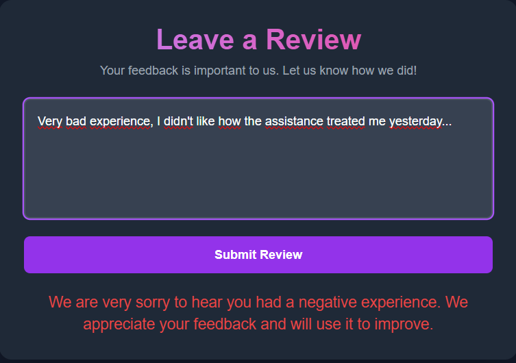

<p align="center">
  <a href="https://huggingface.co/spaces/flaaa31/demo-sentiment" target="_blank">
    
  </a>
</p>

# Online Reputation Monitoring (MLOps Project)

This repository contains the source code for an MLOps project aimed at monitoring a company's online reputation through automated sentiment analysis of social media data.

The system implements a 4-stage CI/CD pipeline that ensures code quality, model performance, and safe, conditional deployment:
**1. CI: Code Testing:** Runs fast unit and integration tests on every push.

**2. CI: Model Training:** Runs on a schedule or manual trigger to train the model and save it as an artifact.

**3. CI: Model Validation:** Tests the trained model artifact against a performance threshold ("Quality Gate").

**4. CD: Conditional Deployment:** Only if model passes validation, it is automatically deployed to Hugging Face Hub.

The final application is served via a FastAPI API (with a live demo) and includes a local monitoring stack using Prometheus and Grafana.

## Demo App
Here is a preview of the interactive web interface built with FastAPI. The UI provides contextual feedback based on user's review sentiment:

| Positive Review (Green) | Neutral Review (Gray) | Negative Review (Red) |
| :---: | :---: | :---: |
|  |  |  |

## Monitoring Dashboard
The project includes a full monitoring stack using Prometheus and Grafana, launched via Docker Compose.

A pre-built Grafana dashboard is available in the `dashboard/` folder. You can import it into Grafana to get an immediate overview of:
* **API Health:** Request Rate (RPS), Latency (P95), and Error Rates.
* **Model Performance:** The real-time distribution of "positive", "negative", and "neutral" predictions.


## CI/CD MLOps Workflow
This project is built around a multi-job workflow defined in .github/workflows/ci-cd.yml.

Job 1 test (Code Quality): Runs on every push/PR. Executes fast unit tests (test_sentiment.py) and integration tests (test_api.py) to verify the code logic.

Job 2 train (Model Training): Runs on schedule or manually. Executes train.py to fine-tune the RoBERTa model and saves the output (e.g., sentiment_model_local/) as a temporary artifact.

Job 3 validate (Model Quality Gate): Runs test_validation.py on the artifact from the train job. This test fails the pipeline if the model's accuracy is below a set threshold (e.g., 70%).

Job 4 deploy (Conditional Deployment): Only runs if validate succeeds. Executes deploy.py to upload the validated model artifact to the Hugging Face Hub, updating the production model.


## Local Execution Guide
To run the entire system in a local development environment (or a Codespace), follow these steps

### Prerequisites
- Python 3.10+
- Docker and Docker Compose installed and running.

### 1. Python Environment Setup
Create and activate a virtual environment, then install the necessary dependencies.

```py
# Create the virtual environment
python3 -m venv .venv

# Activate the environment (on Linux/macOS)
source .venv/bin/activate
# .venv/scripts/activate (on Windows)

# Install the optimized dependencies
pip install -r requirements.txt
```

### 2. Launch the FastAPI API
In a terminal, start the Uvicorn application. 

```bash
uvicorn main:app --reload --host 0.0.0.0
```
**It is crucial to use** ```--host 0.0.0.0 ```
to allow Prometheus (running in Docker) to communicate with the API.

The API will be accessible at ```http://127.0.0.1:8000```.

### 3. Launch the Monitoring System
In a second terminal, start the Prometheus and Grafana containers.

```bash
docker-compose up -d
```

- Prometheus will be available at ```http://localhost:9090```.
- Grafana will be available at ```http://localhost:3000``` (default credentials: ```admin``` / ```admin```).

### Project Structure
- ```main.py```: The main file defining the FastAPI application and the user interface.
- ```sentiment_analyzer.py```: Contains the logic for loading the model and performing sentiment analysis.
- ```train.py```: Script for fine-tuning the model and deploying it to the Hugging Face Hub.
- ```deploy.py```: Script to upload the validated model to the Hugging Face Hub (run by the CI/CD pipeline).
- ```tests/```: Contains unit tests for the sentiment analyzer.
  - ```test_sentiment.py```: Unit tests for the SentimentAnalyzer class.
  - ```test_api.py```: Integration tests for the FastAPI API endpoints.
  - ```test_validation.py```: Model validation test (the "Quality Gate") to check performance.
- ```.github/workflows/ci-cd.yml```: Defines the CI/CD pipeline using GitHub Actions.
- ```docker-compose.yml```: Configuration to launch Prometheus and Grafana.
- ```prometheus.yml```: Configuration file for Prometheus. 
- ```.gitignore```: Specifies files to ignore (e.g., .venv, sentiment_model_local/).  
- ```requirements.txt```: List of Python dependencies.
